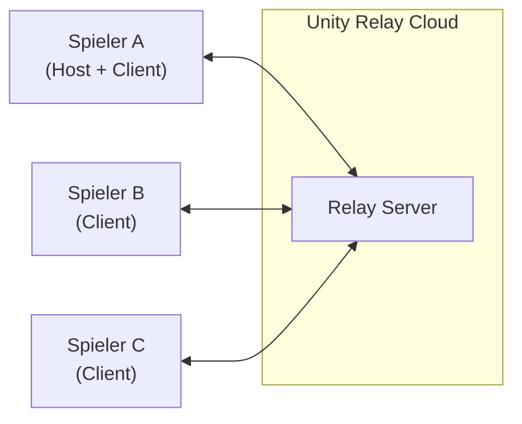
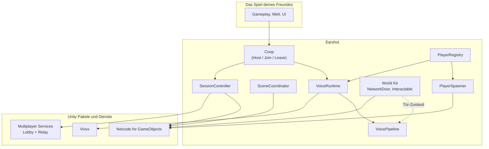
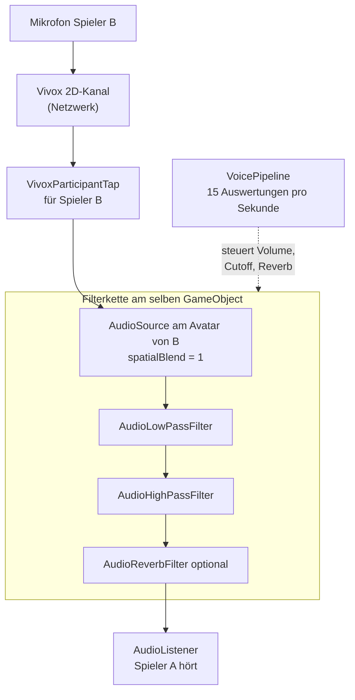
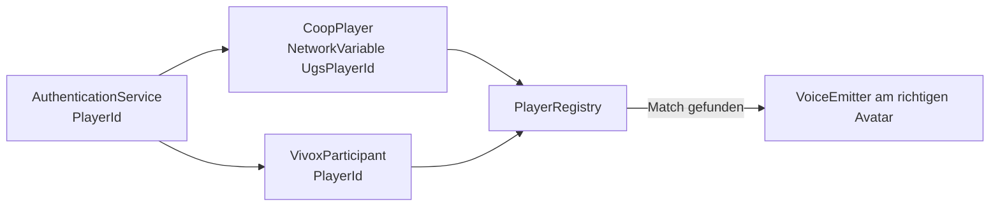
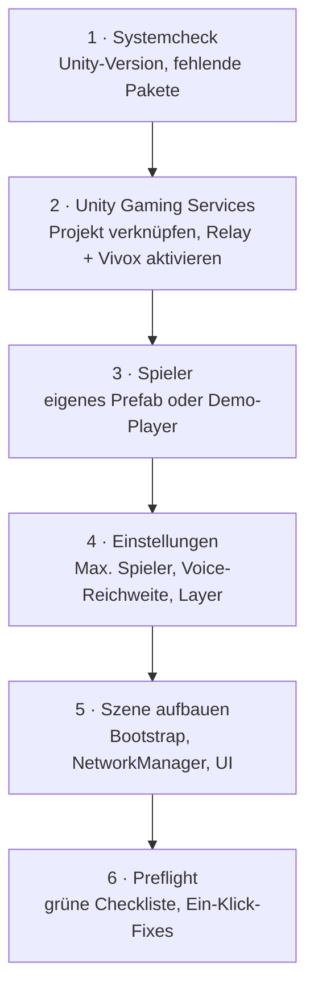
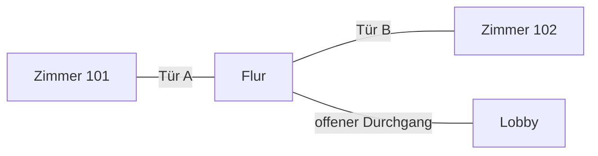

# Earshot — Plug-and-Play Multiplayer + Proximity Voice für Unity 6

> Veraltet für den aktuellen Stand. Multiplayer (`com.earshot.coop`) ist aus diesem
> Repo entfernt. Weiterarbeiten: `docs/earshot-voice-plan.md` und
> `docs/altes-earshot-entfernen.md`.

Stand: 14.08.2026 · Status: Planung abgeschlossen, Umsetzung startet

> **Earshot** — "to be within earshot" heißt "in Hörweite sein". Genau darum geht es.
> Paket-ID `com.earshot.coop`, Namespace `Earshot`, Menü unter `Tools > Earshot`.

---

## 1. Was wir bauen

Ein wiederverwendbares Unity-Package, das ein leeres Unity-6-Projekt in wenigen Minuten
multiplayer-fähig macht — inklusive Proximity Voice Chat, dessen Klangverhalten (Distanz,
Wände, Türen, Räume, Muffling) vollständig über Inspector-Werte und austauschbare Module
steuerbar ist, ohne dass der Nutzer Netzwerk- oder Audio-Code schreiben muss.

**Die Zielerfahrung für deinen Freund:**

1. Unity-6-Projekt öffnen
2. Package Manager → Add package from git URL → einfügen
3. Fenster `Tools > Earshot > Setup` öffnet sich automatisch
4. Auf "Link Unity Gaming Services" klicken (einmalig, ~2 Minuten)
5. Sein Player-Prefab reinziehen (oder "Demo-Player verwenden" anklicken)
6. Max. Spieler einstellen, "Apply Setup" klicken
7. Play drücken → Host starten → Join-Code an einen Freund → funktioniert

Alles danach — wie laut jemand hinter einer Tür klingt, ab welcher Distanz jemand nicht
mehr hörbar ist, ob ein Raum hallt — ist reine Inspector-Arbeit oder ein kleines
austauschbares Modul.

### Nicht-Ziele (bewusst ausgeschlossen)

| Nicht dabei | Warum |
|---|---|
| Dedizierte Server / Anti-Cheat | Für Koop unter Freunden unnötiger Aufwand. Host-Client reicht. |
| WebGL-Support | Vivox unterstützt dort keine Audio Taps → kein Muffling, keine Türen. Steam ist das Ziel. |
| Mehr als 8 Spieler | Ab ~16 braucht es Interest-Management und Voice-Culling. Später nachrüstbar. |
| Fertiges Gameplay (Inventar, Quests) | Aufgabe des jeweiligen Spiels, nicht des Packages. |
| Eigener Voice-Codec / eigene Netzwerkschicht | Sinnlos teuer. Vivox und Relay lösen das besser. |

---

## 2. Technologie-Entscheidung und Begründung

Wir nehmen den **komplett Unity-nativen Stack**. Alle Bausteine kommen aus einer Hand,
brauchen genau **einen Account** (deine Unity-ID) und sind für eure Größenordnung
**dauerhaft kostenlos**.

| Baustein | Paket | Aufgabe |
|---|---|---|
| Netcode | `com.unity.netcode.gameobjects` (2.x) | Objekte, Spieler und Zustand synchronisieren |
| Sessions | `com.unity.services.multiplayer` (2.x) | Lobby + Relay + Join-Code in einer API |
| Voice | `com.unity.services.vivox` (16.x) | Mikrofon, Übertragung, Audio-Taps |
| Transport | `com.unity.transport` | Kommt automatisch mit NGO |
| Testing | `com.unity.multiplayer.playmode` | Mehrere Spieler-Instanzen in einem Editor |

### Warum nicht Photon Fusion 2?

Photon ist gut, aber für dein konkretes Ziel schlechter geeignet:

- **Zwei Accounts statt einem.** Dein Freund bräuchte einen Photon-Account, müsste eine
  App anlegen, die App-ID kopieren, und für Voice nochmal dasselbe. Das ist genau die
  Reibung, die du vermeiden willst.
- **Free-Tier-Falle.** Photons kostenloser 100-CCU-Plan gilt für **eine App pro Account**.
  Wenn dein Freund später ein zweites Spiel macht, ist Schluss. Unity Relay hat diese
  Beschränkung nicht.
- **Kein Vorteil bei Voice.** Photon Voice kann dasselbe wie Vivox, aber Vivox ist bis
  5.000 gleichzeitige Nutzer gratis, Photon Voice rechnet ab CCU.

Photon wäre überlegen bei kompetitiven Shootern mit Rollback-Prediction. Das baust du nicht.

### Kosten und Limits (Stand August 2026)

- **Unity Relay:** kostenlos bis 50 durchschnittliche gleichzeitige Nutzer pro Monat.
  Bei 4 Spielern pro Session und 2.000 Sessions à 15 Minuten im Monat liegt ihr bei
  **2,8 CCU** — also bei etwa 6 % des Freikontingents.
- **Vivox:** kostenlos bis 5.000 gleichzeitige Nutzer pro Monat.
- **Netcode / Transport:** Open Source, kostenlos, keine Limits.
- **Kreditkarte:** nicht erforderlich, solange ihr im Free Tier bleibt.

Praktisch heißt das: Ihr zahlt nichts, bis euer Spiel ein Erfolg ist. Und dann ist Zahlen
kein Problem mehr.

### Welcher Servertyp ist der stabilste?

Für Koop-Spiele ist **Host-Client über Relay** der Standard, und zwar aus einem sehr
konkreten Grund: Ein Spieler ist gleichzeitig Server ("Host"), alle anderen verbinden sich
zu ihm. Weil eine direkte Verbindung durch Router und Firewalls meist scheitert, geht der
Datenverkehr über Unitys Relay-Server. Dadurch braucht **niemand Portfreigaben, VPN oder
Hamachi** — es funktioniert einfach.



Der Nachteil steht ehrlich in Abschnitt 9: Wenn der Host geht, endet die Session.

---

## 3. Architektur

### Gesamtbild



Der wichtige Punkt: **Die `VoicePipeline` hängt nicht an Vivox.** Vivox liefert nur ein
Audiosignal und einen Lautsprecher. Wie dieses Signal klingt, entscheidet ausschließlich
unsere eigene Pipeline. Wenn Vivox in drei Jahren durch etwas anderes ersetzt wird,
tauschst du eine Klasse aus und deine gesamte Tür-, Wand- und Raumlogik bleibt unverändert.

### Die öffentliche API — das ist alles, was ein Nutzer kennen muss

```csharp
using Earshot;

// Verbinden
string code = await Coop.HostAsync();
await Coop.JoinAsync("ABC123");
await Coop.LeaveAsync();

// Zustand
Coop.State          // Offline, Connecting, Hosting, Connected
Coop.JoinCode
Coop.Players        // IReadOnlyList<CoopPlayer>
Coop.LocalPlayer

// Events
Coop.OnStateChanged += state => { };
Coop.OnPlayerJoined += player => { };
Coop.OnPlayerLeft   += player => { };

// Voice
Voice.MicrophoneMuted = true;
Voice.SetProfile(myVoiceProfile);
Voice.IsSpeaking(player);
```

---

## 4. Die Voice-Pipeline — das Herzstück

### Wie das Audiosignal läuft

Vivox bietet sogenannte **Audio Taps**: Statt die Stimmen direkt an die Lautsprecher zu
schicken, kann man das Audio jedes einzelnen Sprechers in eine ganz normale Unity
`AudioSource` umleiten. Genau das machen wir — und hängen diese `AudioSource` an den Avatar
des jeweiligen Spielers in der 3D-Welt.

Ab diesem Moment ist die Stimme für Unity ein Geräusch wie jedes andere, und wir haben die
volle Kontrolle.



Warum ein 2D-Kanal und nicht Vivox' eingebauter 3D-Modus? Weil Vivox im 3D-Modus die
Lautstärke **selbst** berechnet und uns die Kontrolle wegnimmt. Wir wollen aber genau diese
Kontrolle. Im 2D-Kanal überträgt Vivox alle Stimmen unverändert, und die komplette
räumliche Berechnung machen wir lokal. Bei bis zu 8 Spielern ist die Bandbreite dafür
völlig unkritisch.

### Der Modifier-Ansatz — hier liegt die Erweiterbarkeit

Statt einer festverdrahteten Formel läuft für jeden Sprecher eine **Kette von Modulen**.
Jedes Modul bekommt die Situation beschrieben und darf das Klangergebnis verändern.

```csharp
// Was die Pipeline über die Situation weiß
public struct VoiceContext
{
    public Vector3 ListenerPosition;
    public Vector3 SpeakerPosition;
    public float   Distance;
    public float   OcclusionAmount;   // 0 = freie Sicht, 1 = massive Wand
    public float   PortalOpenness;    // 1 = Tür offen, 0 = Tür zu
    public VoiceZone ListenerZone;
    public VoiceZone SpeakerZone;
    public bool    SameZone;
}

// Was am Ende herauskommt
public struct VoiceSample
{
    public float Volume;              // 0..1
    public float LowPassHz;           // 22000 = kein Filter, 500 = sehr dumpf
    public float HighPassHz;
    public float ReverbMix;
    public float SpatialBlend;
    public bool  Muted;               // harter Cutoff
}

// Ein Modul
public interface IVoiceModifier
{
    int Order { get; }
    void Apply(in VoiceContext ctx, ref VoiceSample sample);
}
```

Mitgelieferte Module:

| Modul | Was es macht |
|---|---|
| `DistanceFalloffModifier` | Lautstärke über eine editierbare Kurve; harter Cutoff ab Maximaldistanz |
| `OcclusionModifier` | Raycasts zwischen Zuhörer und Sprecher; Wände dämpfen und machen dumpf |
| `PortalModifier` | Türen und Fenster: eigene Durchlässigkeit statt voller Blockierung |
| `ZoneModifier` | Räume: Grunddämpfung und Hall, unterschiedlich je Raum |
| `RadioModifier` | Beispielmodul: ignoriert Distanz, klingt gefiltert wie ein Funkgerät |

Ein eigenes Modul zu schreiben, sieht so aus:

```csharp
[CreateAssetMenu(menuName = "Earshot/Voice/Unterwasser")]
public class UnderwaterModifier : VoiceModifierAsset
{
    public override int Order => 500;

    public override void Apply(in VoiceContext ctx, ref VoiceSample sample)
    {
        if (!PlayerIsUnderwater) return;
        sample.LowPassHz = Mathf.Min(sample.LowPassHz, 800f);
        sample.Volume   *= 0.6f;
    }
}
```

Danach zieht man das Asset in die Liste des `VoiceProfile` — fertig. Kein Eingriff in
irgendeinen bestehenden Code.

### Tür und Wand konkret

Eine Wand blockiert per Raycast. Eine Tür ist eine Wand mit einem `VoicePortal` daran:

```
VoicePortal (auf der Tür)
├── Geschlossene Durchlässigkeit   0.25   (25 % Lautstärke kommen durch)
├── Geschlossenes Muffling         0.80   (stark gedämpft, dumpf)
├── Offene Durchlässigkeit         1.00
└── Nutzt Tür-Animation            ☑      (folgt weich der Türbewegung)
```

Der Clou: Der `VoicePortal` liest den Zustand nicht vom Netzwerk, sondern von der
**sichtbaren Türbewegung**. Wenn die Tür langsam aufschwingt, öffnet sich der Klang
gleichmäßig mit. Kein plötzliches Umschalten.

### Zwei Details, die über "klingt gut" und "klingt kaputt" entscheiden

**Glättung.** Wenn man eine Filter-Grenzfrequenz abrupt ändert, knackt es hörbar. Das ist
ein bekanntes Unity-Problem. Deshalb wertet die Pipeline die Situation nur ~15-mal pro
Sekunde aus (Raycasts sind teuer), **glättet die Ergebniswerte aber in jedem Frame** weich
gegen den Zielwert. Der Nutzer hört eine stufenlose Bewegung, obwohl darunter grob
gerechnet wird.

**Vivox-Zwangsvorgaben.** Die Audio Taps funktionieren nur sauber, wenn die `AudioSource`
exakt `pitch = 1` und `dopplerLevel = 0` hat. Sonst gibt es sporadische Aussetzer,
besonders bei sich bewegenden Spielern. Das ist kaum dokumentiert und eine klassische
Stolperfalle. Unsere Komponente erzwingt beide Werte im Code, und der Preflight-Check
meldet es, falls sie jemand überschreibt.

---

## 5. Zwei Dinge, die im ersten Entwurf gefehlt haben

Du hattest gefragt, ob noch etwas umständlich ist. Beim genauen Durchgehen sind zwei echte
Lücken aufgefallen — beides Sachen, die einen Tag Fehlersuche kosten, wenn man sie nicht
vorher bedacht hat.

### 5.1 Wer ist wer? Die Zuordnung Stimme ↔ Avatar

Vivox kennt "Teilnehmer", Netcode kennt "Spielerobjekte". Das sind zwei völlig getrennte
Welten. Damit die Stimme von Spieler B aus dem Avatar von Spieler B kommt, brauchen wir
eine verlässliche Brücke — und die war im ersten Entwurf nur vage angedeutet.

Die Lösung ist sauber, weil beide Systeme über denselben Login laufen: Netcode und Vivox
authentifizieren sich beide über Unitys `AuthenticationService`. Damit ist die
`PlayerId` dieses Dienstes eine ID, die **beide Seiten kennen**.



Der knifflige Teil sind die Wettlaufsituationen, denn die Reihenfolge ist nicht garantiert:

- **Stimme kommt vor Avatar** (Vivox ist schneller als der Spawn) → Teilnehmer wird geparkt,
  der Tap entsteht, sobald der Avatar da ist.
- **Avatar kommt vor Stimme** (Spawn ist schneller als der Vivox-Login) → Avatar wird
  geparkt, der Tap entsteht beim Beitritt zum Kanal.
- **Avatar verschwindet, Stimme bleibt** → Tap wird nur abgehängt, nicht zerstört. Wichtig,
  weil die Lebensdauer des Tap-Objekts Vivox gehört, nicht uns.
- **Man selbst** → kein Tap, man hört sich nicht selbst.

Der `PlayerRegistry` hält beide Seiten und eine Warteliste. Das klingt nach wenig, ist aber
genau die Stelle, an der solche Systeme sonst unzuverlässig werden.

### 5.2 Szenenwechsel — und warum die Standardeinstellung gefährlich ist

Das hatte ich schlicht vergessen. Fast jedes Spiel hat mindestens Hauptmenü und Spielwelt.
Netcode muss Szenenwechsel synchronisieren, sonst steht ein Spieler noch im Menü, während
der andere schon im Hotel ist.

Dabei bin ich auf etwas gestoßen, das für ein Drop-in-Package richtig unangenehm wäre:
Netcodes **Standardverhalten** ist, dass ein beitretender Client **seine eigenen Szenen
entlädt** und die des Hosts lädt. In einem fremden Projekt, in das man unser Package nur
reinzieht, ist das ein zerstörerischer Nebeneffekt — plötzlich verschwindet das UI oder
eine dauerhaft geladene Manager-Szene des Nutzers.

Deshalb setzt Earshot beim Start automatisch:

```csharp
NetworkManager.Singleton.SceneManager.SetClientSynchronizationMode(LoadSceneMode.Additive);
NetworkManager.Singleton.SceneManager.PostSynchronizationSceneUnloading = false;
```

Damit behalten Clients ihre eigenen Szenen, und trotzdem werden alle Netzwerkobjekte
korrekt synchronisiert. Der `SceneCoordinator` kapselt das und bietet ein einfaches
`Coop.LoadSceneAsync("Hotel")`, das nur der Host auslösen darf.

---

## 6. Repo-Struktur

```
MultiplayerNetworkPackage/
├── PLAN.md                          ← dieses Dokument
├── README.md                        ← Kurzanleitung für Nutzer
├── .gitignore
└── DevProject/                      ← Unity-Projekt zum Entwickeln und Testen
    ├── Assets/
    │   └── Scenes/TestWorld.unity   ← unsere Spielwiese, nicht Teil des Packages
    ├── ProjectSettings/
    └── Packages/
        ├── manifest.json
        └── com.earshot.coop/        ← DAS ist das ausgelieferte Package
            ├── package.json
            ├── README.md
            ├── CHANGELOG.md
            ├── LICENSE.md
            ├── Runtime/
            │   ├── Earshot.Runtime.asmdef
            │   ├── Core/
            │   │   ├── Coop.cs                  ← die öffentliche Fassade
            │   │   ├── CoopSettings.cs          ← ScriptableObject mit allen Werten
            │   │   ├── CoopBootstrap.cs         ← Szenen-Einstiegspunkt
            │   │   └── CoopServices.cs          ← UGS-Init und anonyme Anmeldung
            │   ├── Session/
            │   │   ├── SessionController.cs     ← Create/Join/Leave, Join-Code
            │   │   ├── SceneCoordinator.cs      ← synchrones Szenenladen
            │   │   ├── ITransportProvider.cs    ← Austauschpunkt für Steam später
            │   │   └── RelayTransportProvider.cs
            │   ├── Player/
            │   │   ├── CoopPlayer.cs            ← Identität, Netzwerk-Zustand
            │   │   ├── PlayerRegistry.cs        ← Brücke Netcode ↔ Vivox
            │   │   ├── CoopPlayerSpawner.cs     ← Spawnpunkte, Verteilung
            │   │   ├── CoopPlayerInteractor.cs  ← Blick-Raycast zum Interagieren
            │   │   └── Demo/FirstPersonController.cs
            │   ├── World/
            │   │   ├── NetworkDoor.cs           ← synchron + treibt VoicePortal
            │   │   ├── NetworkInteractable.cs   ← generische Basis
            │   │   └── NetworkOwnership.cs      ← Besitz anfordern
            │   ├── Voice/
            │   │   ├── IVoiceBackend.cs         ← die Austauschgrenze
            │   │   ├── VivoxVoiceBackend.cs
            │   │   ├── Voice.cs                 ← öffentliche Voice-Fassade
            │   │   ├── VoiceRuntime.cs          ← verbindet Backend mit Spielern
            │   │   ├── VoiceEmitter.cs          ← AudioSource + Filter pro Sprecher
            │   │   ├── VoicePipeline.cs         ← die Modifier-Kette
            │   │   ├── VoiceContext.cs
            │   │   ├── VoiceProfile.cs          ← ScriptableObject
            │   │   ├── VoiceZone.cs
            │   │   ├── VoicePortal.cs
            │   │   ├── VoiceDebugInjector.cs    ← AudioClip statt Mikrofon
            │   │   └── Modifiers/
            │   │       ├── DistanceFalloffModifier.cs
            │   │       ├── OcclusionModifier.cs
            │   │       ├── PortalModifier.cs
            │   │       ├── ZoneModifier.cs
            │   │       └── RadioModifier.cs
            │   └── UI/
            │       └── CoopQuickMenu.cs         ← Host/Join/Code, sofort nutzbar
            ├── Editor/
            │   ├── Earshot.Editor.asmdef
            │   ├── SetupWizardWindow.cs
            │   ├── PreflightValidator.cs
            │   ├── PlayerPrefabConverter.cs
            │   ├── PackageInstaller.cs          ← schreibt in manifest.json
            │   └── SceneBuilder.cs              ← baut die Demo-Szene per Code
            ├── Samples~/
            │   ├── QuickStart/
            │   └── CustomVoiceModifier/
            └── Tests/
                └── EditMode/                    ← Pipeline-Mathematik ohne Netzwerk
```

**Installations-URL für deinen Freund:**

```
https://github.com/<dein-user>/MultiplayerNetworkPackage.git?path=/DevProject/Packages/com.earshot.coop
```

### Öffentliches Repo — Privatsphäre-Checkliste

Du hattest recht mit der Sorge. Konkret müssen wir auf vier Dinge achten:

1. **`ProjectSettings/ProjectSettings.asset`** enthält deine `cloudProjectId` und deine
   Organisations-ID von Unity Gaming Services. → per `.gitignore` ausgeschlossen.
2. **`Assets/StreamingAssets/UnityServicesProjectConfiguration.json`** wird von UGS
   automatisch erzeugt und enthält ebenfalls deine Projekt-ID. → ausgeschlossen.
3. **`.csproj` / `.sln` / `Library/` / `UserSettings/`** enthalten absolute Pfade wie
   `C:\Users\npile\...`. → ausgeschlossen.
4. **Keine Credentials im Code.** Vivox-Zugangsdaten holt sich Unity zur Laufzeit über die
   Projektverknüpfung. Es landet nie ein Schlüssel in einer Datei.

Vor dem ersten Push mache ich einen expliziten Durchlauf, der das Repo nach `npile`,
`C:\Users`, `cloudProjectId` und ähnlichen Mustern durchsucht.

---

## 7. Der Setup-Wizard

Das ist der Teil, der aus "funktionierender Code" ein "Plug-and-Play-Produkt" macht.



Was der Wizard automatisch erledigt, damit dein Freund es nicht tun muss:

- Fehlende Pakete über den Package Manager nachinstallieren
- Prüfen, ob das Projekt mit Unity Gaming Services verknüpft ist, und sonst mit einem Klick
  die richtige Einstellungsseite öffnen — inklusive Erklärung, was auf dem Dashboard
  einzuschalten ist
- Aus einem beliebigen Player-Prefab ein netzwerkfähiges machen: `NetworkObject`,
  `NetworkTransform` (Owner-authoritativ für flüssige Steuerung), `CoopPlayer`,
  Voice-Anhängepunkt in Kopfhöhe
- Das Prefab in der `NetworkPrefabs`-Liste des `NetworkManager` registrieren
- `CoopBootstrap` und ein Standard-UI mit Host-/Join-Buttons in die Szene setzen
- Ein `CoopSettings`-Asset im Projekt anlegen und dorthin verknüpfen

### Preflight-Check

Eine Liste mit grünen und roten Punkten, jeder rote Punkt mit einem "Fix"-Button:

- Unity-Version ≥ 6000.0
- Alle benötigten Pakete installiert
- Projekt mit UGS verknüpft
- Relay im Dashboard aktiviert
- Vivox im Dashboard aktiviert
- `NetworkManager` in der Szene vorhanden
- Player-Prefab registriert und hat `NetworkObject`
- Alle genutzten Szenen in der Build-Liste (sonst schlägt synchrones Laden fehl)
- Genau ein `AudioListener` in der Szene
- Mikrofonberechtigung vorhanden
- Occlusion-LayerMask nicht leer (sonst blockiert nichts)
- `VoiceProfile` zugewiesen

Damit ist der häufigste Frustfall abgedeckt: Es startet nicht, und man weiß nicht warum.

---

## 8. Umsetzungsphasen

Jede Phase endet mit etwas, das man tatsächlich ausprobieren kann.

### Phase 1 — Gerüst (`v0.1`)

Repo-Struktur, `package.json` mit `"unity": "6000.0"`, Assembly Definitions,
`.gitignore`, leeres Dev-Projekt. Ergebnis: Package lässt sich per Git-URL installieren
und kompiliert.

### Phase 2 — Verbinden (`v0.2`)

`CoopSettings`, `CoopServices` (UGS-Init + anonyme Anmeldung), `SessionController` mit
Relay, `Coop`-Fassade, `SceneCoordinator`, `CoopQuickMenu`.
**Ergebnis: Zwei Instanzen verbinden sich per Join-Code über das Internet.**

### Phase 3 — Spieler (`v0.3`)

`CoopPlayer`, `PlayerRegistry`, `CoopPlayerSpawner`, Owner-authoritatives
`NetworkTransform`, First-Person-Demo-Controller, `PlayerPrefabConverter`.
**Ergebnis: Zwei Spieler laufen sichtbar in derselben Welt herum.**

### Phase 4 — Stimme (`v0.4`)

`IVoiceBackend`, `VivoxVoiceBackend` (Login, 2D-Kanal, Taps), `VoiceEmitter`,
`VoiceRuntime`, einfacher Distanz-Falloff.
**Ergebnis: Man hört sich, und zwar leiser, wenn man weiter weg ist.**

### Phase 5 — Das eigentliche Feature (`v0.5`)

`VoicePipeline` mit Modifier-Kette, `VoiceProfile`, Occlusion per Raycast, `VoicePortal`,
`VoiceZone`, Glättung, `VoiceDebugInjector`, EditMode-Tests für die Pipeline-Mathematik.
**Ergebnis: Hinter der geschlossenen Tür klingt jemand dumpf und leise. Tür auf → klar.**

### Phase 6 — Welt-Baukasten (`v0.6`)

`NetworkDoor`, `NetworkInteractable`, `NetworkOwnership`, `CoopPlayerInteractor`.
**Ergebnis: Beide Spieler sehen dieselbe Tür auf- und zugehen.**

### Phase 7 — Produkt (`v0.9`)

Setup-Wizard, Preflight-Validator, `SceneBuilder`, Project-Settings-Seite.
**Ergebnis: Ein fremdes Projekt ist in unter 5 Minuten eingerichtet.**

### Phase 8 — Auslieferung (`v1.0`)

QuickStart-Sample (zwei Räume, Tür, Wand), zweites Sample für eigene Modifier, README,
Troubleshooting, Privatsphäre-Durchlauf, Test der Git-URL-Installation in einem frischen
Projekt, Build-Test auf zwei Rechnern.

### Zeitaufwand

Die reine Bauzeit liegt bei etwa **8 bis 15 Arbeitstagen**, wenn ich den Code schreibe.
Der Löwenanteil deiner Zeit geht nicht in Programmieren, sondern in zwei andere Dinge:

- **Testen mit einem echten zweiten Rechner.** Voice lässt sich nur begrenzt allein testen,
  weil beide Instanzen dasselbe Mikrofon wollen. Dafür gibt es den `VoiceDebugInjector`,
  aber ein echter Test mit einem Freund bleibt nötig.
- **Klang-Feintuning.** Wie dumpf ist "hinter einer Tür"? Das ist Geschmackssache und
  braucht Hin-und-her. Genau deshalb ist alles über Kurven und Inspector-Werte einstellbar
  und nicht im Code festgeschrieben.

---

## 9. Ehrliche Grenzen von Version 1

Damit es keine Überraschungen gibt — das sind bewusste Kompromisse, keine Bugs:

**Wenn der Host geht, endet die Session.** Das ist bei Host-Client-Architektur systembedingt.
Für Koop unter Freunden akzeptabel, aber dein Freund sollte es wissen, bevor er ein Hotel
mit stundenlangen Spielsessions baut. Host-Migration steht in der Roadmap, ist aber ohne
dedizierten Server immer nur eine Teillösung.

**Kein Speicherstand.** Earshot synchronisiert Zustand zwischen Spielern, speichert aber
nichts auf Festplatte. Wer einen Spielstand will, baut den selbst — das ist bewusst
Aufgabe des Spiels, nicht des Netzwerk-Packages.

**Kein automatischer Reconnect.** Ein WLAN-Aussetzer fliegt aus der Session. Geplant für v1.5.

**Schall geht nicht um Ecken** (siehe v1.1 — wird als Erstes behoben).

**Im 2D-Kanal empfängt jeder Client alle Stimmen**, auch von weit entfernten Spielern; die
Filterung passiert lokal. Bei acht befreundeten Spielern egal, aber technisch könnte ein
manipulierter Client alle mithören. Echte Lösung ist Voice-Culling in v1.4.

---

## 10. Roadmap nach Version 1.0

### v1.1 — Realistische Schallausbreitung (fest zugesagt)

**Das ist der Punkt, den du dir vorgenommen hast, und er steht bewusst ganz oben.**

Das Problem: Ein Raycast prüft nur die direkte Verbindungslinie zwischen zwei Spielern.
In einem Hotel mit L-förmigen Fluren heißt das, jemand um die Ecke klingt wie hinter einer
massiven Wand — obwohl der Schall real durch den Flur zu dir käme. Für ein Hotel-Spiel ist
das genau der falsche Fehler.

Die professionelle Lösung ist ein **Raum-Portal-Graph**:



Statt einer geraden Linie sucht der Schall den **kürzesten Weg durch verbundene Räume**.
Jede Tür und jeder Durchgang auf diesem Weg dämpft ein Stück. Ergebnis: Jemand um die Ecke
im selben Flur klingt nah und klar, jemand im Zimmer nebenan gedämpft — auch wenn die
direkte Luftlinie in beiden Fällen durch eine Wand geht.

Zusätzlich in dieser Version:

- Mehrfach-Raycasts für teilweise Verdeckung (halb hinter einer Säule)
- Richtungskorrektur: Die Stimme kommt aus Richtung der offenen Tür, nicht durch die Wand
- Hall-Presets pro Raumtyp (Badezimmer, Halle, Keller)

Weil die Modifier-Architektur von Anfang an dafür ausgelegt ist, kommt der Graph als
**zusätzliches Modul** dazu. Der bestehende `OcclusionModifier` bleibt als leichtgewichtige
Alternative für Spiele im Freien erhalten. Niemand muss etwas umbauen.

### v1.2 — Steam-Transport

Steam Sockets als Alternative zu Relay: unbegrenzt kostenlos, "Freund beitreten" direkt
über die Steam-Freundesliste, kein CCU-Limit. Braucht eine Steam-AppID (100 $ einmalig
über Steam Direct). Der Austauschpunkt `ITransportProvider` existiert ab Phase 2.

Technische Notiz: Der Steam-Transport ist ein Git-Paket, und Unity erlaubt
Git-Abhängigkeiten **nicht** innerhalb einer `package.json` — nur in der `manifest.json`
des Projekts. Deshalb muss der Wizard diesen Eintrag selbst schreiben. Das ist der Grund,
warum `PackageInstaller.cs` existiert.

### v1.3 — Voice-Komfort

Push-to-Talk mit konfigurierbarer Taste, Sprechindikator über dem Kopf und in der
Spielerliste, Lautstärkeregler und Stummschalten pro Spieler, Mikrofonauswahl und
Eingangspegelanzeige im UI.

### v1.4 — Größere Gruppen

Ab etwa 16 Spielern: Voice-Culling (Spieler außerhalb der Hörweite werden auf Netzwerkebene
stummgeschaltet statt nur lokal leise gedreht) und Interest-Management für
Transform-Updates. Optional Vivox' positionale Kanäle als grobe Vorfilterung.

### v1.5 — Betrieb und Stabilität

Wiederverbinden nach Verbindungsabbruch, Host-Migration soweit ohne dedizierten Server
machbar, optionale dedizierte Server über Unity Multiplay Hosting, Netzwerkstatistiken im
Spiel (Ping, Paketverlust).

---

## 11. Risiken und wie wir sie adressieren

Diese Punkte stammen aus der Recherche in Unity-Dokumentation und Entwicklerforen. Es sind
die Stellen, an denen Projekte typischerweise hängen bleiben.

| Risiko | Auswirkung | Gegenmaßnahme |
|---|---|---|
| Audio Taps brauchen `pitch = 1` und `dopplerLevel = 0` | Sporadische Aussetzer bei Bewegung, extrem schwer zu diagnostizieren | Werte werden im Code erzwungen, Preflight prüft sie |
| Doppeltes Audio (Kanal-Mix **und** Tap spielen) | Jeder klingt doppelt und nicht räumlich | Pro Sprecher genau ein Tap mit gesetztem "Silence in Channel Audio Mix"; Fallback über Ausgabegerät "No Device" |
| Abrupte Filterwechsel knacken | Türen klingen billig | Grobe Auswertung (15 Hz), weiche Interpolation pro Frame |
| Netcode entlädt beim Beitritt die Szenen des Clients | Zerstört fremde Projekte beim Reinziehen des Packages | Client-Sync-Modus wird auf `Additive` gesetzt, Nachladen-Entladen deaktiviert |
| Zuordnung Stimme ↔ Avatar schlägt fehl | Stimme kommt vom falschen oder von keinem Avatar | `PlayerRegistry` mit UGS-`PlayerId` als gemeinsamem Schlüssel und Warteliste für beide Reihenfolgen |
| Mikrofon lässt sich nicht mehrfach im Editor testen | Voice-Entwicklung fühlt sich blockiert an | `VoiceDebugInjector` speist einen AudioClip statt des Mikrofons ein; Vivox-Echo-Kanal für Selbsttest |
| Mehrere Editor-Instanzen brauchen verschiedene Anmeldungen | Zweite Instanz wird abgewiesen | `AuthenticationService.SwitchProfile` mit eindeutigem Namen pro Instanz |
| Git-URL-Installation braucht installiertes Git | Freund kann nicht installieren | Im README erwähnt, plus `.unitypackage`-Fallback |
| Unity 6 ist Pflicht | Freunde auf Unity 2022 sind ausgeschlossen | Bewusste Entscheidung; `package.json` meldet Inkompatibilität sauber statt zu crashen |

### Zu deiner Frage nach Unity-Versionen

`package.json` bekommt `"unity": "6000.0"` als Minimum. Das bedeutet:

- **Unity 6 LTS (6000.0):** funktioniert. Falls Freunde darauf sind, ist alles gut.
- **Unity 6.4 / 6.5 / 6.6 und neuer:** funktioniert. Unity-Pakete sind innerhalb einer
  Major-Version aufwärtskompatibel, und wir nutzen bewusst nur APIs aus der 2.0-Basislinie
  von Netcode, keine brandneuen Randfunktionen.
- **Unity 2022 LTS und älter:** funktioniert nicht. Der Package Manager zeigt das Paket dann
  gar nicht erst an, statt kryptische Compilerfehler zu produzieren.
- **Ein künftiges Unity 7:** unbekannt, aber unser Code hat eine kleine Angriffsfläche, weil
  die ganze Provider-Logik hinter Interfaces liegt.

Eine wichtige praktische Regel: Wenn du und dein Freund am **selben Projekt** arbeitet,
müsst ihr **exakt dieselbe Unity-Version** nutzen. Das gilt aber immer bei Unity und hat
nichts mit unserem Package zu tun. Das Package selbst ist versionstolerant.

---

## 12. Frühere Review-Korrekturen

**AudioMixer mit Snapshots war überengineert.** Ein Snapshot gilt global, aber jeder
Sprecher braucht individuelle Werte — Person A steht hinter der Tür, Person B daneben. Man
bräuchte eine Mixer-Gruppe pro Spielerplatz plus umständliche Parameter-Ansteuerung. Bei
maximal 8 Spielern sind einzelne Filterkomponenten pro `AudioSource` einfacher, flexibler
und schnell genug. Der Mixer bleibt für das drin, wofür er gut ist: eine gemeinsame
Voice-Spur, damit man Sprachlautstärke getrennt von der Musik regeln und die Musik beim
Sprechen absenken kann.

**Vivox' Ausgabegerät auf "No Device" zu setzen war der schlechtere Weg.** Das schaltet
global alle Vivox-Ausgabe stumm und hatte laut Forum in manchen SDK-Versionen einen
Anmeldungs-Bug. Sauberer ist `silenceInChannelAudioMix` direkt beim Erzeugen des Taps: pro
Sprecher, gezielt, ohne Nebenwirkungen. Der bekannte Fehler dieser Option betrifft nur
mehrere Taps für **denselben** Sprecher — den Fall haben wir nicht.

---

## 13. Offene Punkte

- **GitHub-Repo.** Existiert noch nicht als Git-Repository. Wird in Phase 1 initialisiert.
- **Steam-AppID.** Erst relevant für v1.2.
